# AUDIT ARCHITECTURE SITEMAP — ServicesArtisans.fr

**Date :** 24 février 2026
**Scope :** Architecture complète des sitemaps XML, génération, publication, monitoring
**Méthode :** Analyse statique du code source (revue de code exhaustive)

---

## TABLE DES MATIÈRES

1. [Carte complète des sitemaps](#1-carte-complète-des-sitemaps)
2. [Trace end-to-end](#2-trace-end-to-end)
3. [Vérification Googlebot-proof](#3-vérification-googlebot-proof)
4. [Diagramme d'architecture](#4-diagramme-darchitecture)
5. [Mode de génération](#5-mode-de-génération-batch-vs-dynamique)
6. [Spécification technique](#6-spécification-technique)
7. [Audit par exécution locale](#7-audit-par-exécution-locale)
8. [File tree des fichiers pertinents](#8-file-tree-des-fichiers-pertinents)

---

## 1. CARTE COMPLÈTE DES SITEMAPS

### 1.1 Inventaire exhaustif des endpoints

| # | Endpoint HTTP | Source fichier | Type | Méthode de génération |
|---|---|---|---|---|
| 1 | `/sitemap.xml` | `src/app/api/sitemap-index/route.ts` | Index | Dynamique (rewrite next.config.js) |
| 2 | `/sitemap/static.xml` | `src/app/sitemap.ts` | Sitemap | Build-time (Next.js generateSitemaps) |
| 3 | `/sitemap/service-cities-{i}.xml` | `src/app/sitemap.ts` | Sitemap | Build-time |
| 4 | `/sitemap/cities.xml` | `src/app/sitemap.ts` | Sitemap | Build-time |
| 5 | `/sitemap/geo.xml` | `src/app/sitemap.ts` | Sitemap | Build-time |
| 6 | `/sitemap/quartiers.xml` | `src/app/sitemap.ts` | Sitemap | Build-time |
| 7 | `/sitemap/service-quartiers-{i}.xml` | `src/app/sitemap.ts` | Sitemap | Build-time |
| 8 | `/sitemap/devis-services.xml` | `src/app/sitemap.ts` | Sitemap | Build-time |
| 9 | `/sitemap/devis-service-cities-{i}.xml` | `src/app/sitemap.ts` | Sitemap | Build-time |
| 10 | `/sitemap/devis-quartiers-{i}.xml` | `src/app/sitemap.ts` | Sitemap | Build-time |
| 11 | `/sitemap/urgence-service-cities-{i}.xml` | `src/app/sitemap.ts` | Sitemap | Build-time |
| 12 | `/sitemap/tarifs-service-cities-{i}.xml` | `src/app/sitemap.ts` | Sitemap | Build-time |
| 13 | `/sitemap/avis-services.xml` | `src/app/sitemap.ts` | Sitemap | Build-time |
| 14 | `/sitemap/avis-service-cities-{i}.xml` | `src/app/sitemap.ts` | Sitemap | Build-time |
| 15 | `/sitemap/problemes.xml` | `src/app/sitemap.ts` | Sitemap | Build-time |
| 16 | `/sitemap/problemes-cities-{i}.xml` | `src/app/sitemap.ts` | Sitemap | Build-time |
| 17 | `/sitemap/dept-services-{i}.xml` | `src/app/sitemap.ts` | Sitemap | Build-time |
| 18 | `/sitemap/region-services.xml` | `src/app/sitemap.ts` | Sitemap | Build-time |
| 19 | `/sitemap/guides.xml` | `src/app/sitemap.ts` | Sitemap | Build-time |
| 20 | `/sitemap/providers-{i}.xml` | `src/app/api/sitemap-providers/route.ts` | Sitemap | Runtime (rewrite next.config.js) |
| 21 | `/news-sitemap.xml` | `src/app/news-sitemap.xml/route.ts` | News | Runtime |
| 22 | `/image-sitemap.xml` | `src/app/image-sitemap.xml/route.ts` | Image | Runtime |
| 23 | `/feed.xml` | `src/app/feed.xml/route.ts` | RSS | Runtime (non-sitemap) |

### 1.2 Détail par sitemap

#### `/sitemap.xml` — Index principal

- **Fichier :** `src/app/api/sitemap-index/route.ts:20-93`
- **Rewrite :** `/sitemap.xml` → `/api/sitemap-index` (`next.config.js:100`)
- **Source :** Calcul statique des IDs + COUNT dynamique sur `providers`
- **Requête DB :** `supabase.from('providers').select('*', { count: 'exact', head: true }).eq('is_active', true).eq('noindex', false)`
- **Pagination/segmentation :** N/A (c'est l'index)
- **Compression :** Gzip automatique via `next.config.js:5` (`compress: true`) + Vercel Edge
- **Cache :** `s-maxage=3600, stale-while-revalidate=86400`
- **Risque index→fichier inexistant :** OUI (voir §1.4)

#### `/sitemap/static.xml`

- **Fichier :** `src/app/sitemap.ts:89-143`
- **Source :** Données statiques in-memory (pas de DB)
- **Contenu :** Homepage + 20 pages statiques + articles blog (~125) + services index + 15 pages services + pages urgence + pages tarifs
- **Taille estimée :** ~200 URLs
- **lastmod :** Seulement sur les articles blog (`article.updatedDate || article.date`)

#### `/sitemap/service-cities-{i}.xml` (Phase 1)

- **Fichier :** `src/app/sitemap.ts:147-161`
- **Source :** `services[]` (46) × `villes[0..299]` (top 300)
- **Formule :** `ceil(46 × 300 / 45_000)` = **1 fichier** (13 800 URLs)
- **Batch :** `LARGE_BATCH = 45_000`
- **Filtrage :** `TOP_CITIES_PHASE1 = 300` — seules les 300 premières villes
- **lastmod :** Aucun

#### `/sitemap/cities.xml`

- **Fichier :** `src/app/sitemap.ts:181-191`
- **Source :** `villes[]` (2 267 communes ≥5 000 hab.)
- **Taille :** 2 268 URLs (1 index + 2 267 villes)
- **1 fichier unique** — pas de pagination

#### `/sitemap/geo.xml`

- **Fichier :** `src/app/sitemap.ts:194-211`
- **Source :** `departements[]` (101) + `regions[]` (18)
- **Taille :** 121 URLs
- **1 fichier unique**

#### `/sitemap/quartiers.xml`

- **Fichier :** `src/app/sitemap.ts:215-221`
- **Source :** `getQuartiersByVille()` pour chaque ville
- **Taille :** 8 205 URLs
- **1 fichier unique**

#### `/sitemap/service-quartiers-{i}.xml`

- **Fichier :** `src/app/sitemap.ts:224-243`
- **Source :** `services[]` (46) × `villes[]` × `quartiers[]`
- **Formule :** `ceil(Σ(quartiers_per_ville × 46) / 10_000)` = `ceil(46 × 8_205 / 10_000)` ≈ **38 fichiers** (~377 430 URLs)
- **Batch :** `STATIC_BATCH = 10_000`
- **Itération :** Boucle triple imbriquée (service→ville→quartier) avec compteur offset
- **⚠️ Note :** Le calcul exact dépend de la distribution des quartiers par ville (la somme n'est pas simplement 46 × 8205 car chaque ville a un nombre variable de quartiers)

#### `/sitemap/devis-services.xml`

- **Fichier :** `src/app/sitemap.ts:247-251`
- **Source :** `Object.keys(tradeContent)` (46 métiers)
- **Taille :** 46 URLs
- **1 fichier unique**

#### `/sitemap/devis-service-cities-{i}.xml`

- **Fichier :** `src/app/sitemap.ts:254-271`
- **Source :** `services[]` (46) × `villes[]` (2 267)
- **Formule :** `ceil(46 × 2_267 / 10_000)` = **11 fichiers** (104 282 URLs)
- **Batch :** `STATIC_BATCH = 10_000`

#### `/sitemap/devis-quartiers-{i}.xml`

- **Fichier :** `src/app/sitemap.ts:274-293`
- **Source :** `services[]` (46) × `villes[]` × `quartiers[]` (via `getQuartiersByVille`)
- **Formule :** `ceil(46 × 8_205 / 10_000)` ≈ **38 fichiers**
- **⚠️ DIVERGENCE :** Dans `sitemap.ts:44-50`, le calcul utilise `v.quartiers?.length` (propriété directe). Dans `sitemap-index/route.ts:23-26`, il utilise `getQuartiersByVille(v.slug)?.length`. Si ces deux accessors retournent des valeurs différentes → nombre de fichiers différent → index pointe vers des fichiers inexistants.

#### `/sitemap/urgence-service-cities-{i}.xml`

- **Fichier :** `src/app/sitemap.ts:297-315`
- **Source :** `emergencySlugs` (métiers avec `emergencyInfo`) × `villes[]`
- **Formule :** `ceil(46 × 2_267 / 10_000)` = **11 fichiers** (104 282 URLs) — **TOUS les 46 métiers ont `emergencyInfo`**
- **Batch :** `STATIC_BATCH = 10_000`
- **⚠️ Impact :** Beaucoup plus volumineux qu'attendu car 100% des métiers ont le flag urgence

#### `/sitemap/tarifs-service-cities-{i}.xml`

- **Fichier :** `src/app/sitemap.ts:318-335`
- **Source :** `services[]` (46) × `villes[]` (2 267)
- **Formule :** `ceil(46 × 2_267 / 10_000)` = **11 fichiers** (104 282 URLs)

#### `/sitemap/avis-services.xml`

- **Fichier :** `src/app/sitemap.ts:338-344`
- **Source :** `Object.keys(tradeContent)` (46 métiers)
- **Taille :** 47 URLs (1 index /avis + 46 métiers)

#### `/sitemap/avis-service-cities-{i}.xml`

- **Fichier :** `src/app/sitemap.ts:347-365`
- **Source :** `Object.keys(tradeContent)` (46) × `villes[]` (2 267)
- **Formule :** `ceil(46 × 2_267 / 10_000)` = **11 fichiers** (104 282 URLs)

#### `/sitemap/problemes.xml`

- **Fichier :** `src/app/sitemap.ts:368-373`
- **Source :** `getProblemSlugs()` (30 problèmes)
- **Taille :** 31 URLs

#### `/sitemap/problemes-cities-{i}.xml`

- **Fichier :** `src/app/sitemap.ts:377-395`
- **Source :** `getProblemSlugs()` (30) × `villes[]` (2 267)
- **Formule :** `ceil(30 × 2_267 / 10_000)` = **7 fichiers** (68 010 URLs)

#### `/sitemap/dept-services-{i}.xml`

- **Fichier :** `src/app/sitemap.ts:398-408`
- **Source :** `departements[]` (101) × `getTradesSlugs()` (46)
- **Formule :** `ceil(101 × 46 / 45_000)` = **1 fichier** (4 646 URLs)
- **Batch :** `LARGE_BATCH = 45_000`

#### `/sitemap/region-services.xml`

- **Fichier :** `src/app/sitemap.ts:411-418`
- **Source :** `regions[]` (18) × `getTradesSlugs()` (46)
- **Taille :** 828 URLs
- **1 fichier unique**

#### `/sitemap/guides.xml`

- **Fichier :** `src/app/sitemap.ts:421-427`
- **Source :** `getGuideSlugs()` (29 guides)
- **Taille :** 30 URLs (1 index + 29 guides)

#### `/sitemap/providers-{i}.xml` (dynamique)

- **Fichier :** `src/app/api/sitemap-providers/route.ts:165-241`
- **Rewrite :** `/sitemap/providers-:id.xml` → `/api/sitemap-providers?id=:id` (`next.config.js:102`)
- **Source DB :** `providers` (is_active=true, noindex=false)
- **Formule :** `ceil(active_providers / 5_000)` — avec ~350 000 providers ≈ **70 fichiers**
- **Batch :** `PROVIDER_BATCH_SIZE = 5_000`
- **Pagination DB :** Chunks de `PAGE_SIZE = 1_000` lignes
- **Colonnes :** `id, name, slug, stable_id, specialty, address_city, updated_at`
- **Filtrage :** `is_active=true AND noindex=false`
- **lastmod :** `provider.updated_at` (date ISO)
- **Mapping URL :** `specialtyToSlug` (102 entrées) + `serviceMap` + `villeMap` + `inseeMap` + `arrondissementMap`

#### `/news-sitemap.xml`

- **Fichier :** `src/app/news-sitemap.xml/route.ts:18-61`
- **Source :** `allArticles` filtrés < 48h
- **Namespace :** `xmlns:news="http://www.google.com/schemas/sitemap-news/0.9"`
- **Cache :** `max-age=3600, s-maxage=3600`
- **Taille :** 0-5 URLs (selon fréquence de publication)

#### `/image-sitemap.xml`

- **Fichier :** `src/app/image-sitemap.xml/route.ts:35-116`
- **Source :** Images statiques (services, villes top 20, blog, pages statiques)
- **Namespace :** `xmlns:image="http://www.google.com/schemas/sitemap-image/1.1"`
- **Cache :** `max-age=86400, s-maxage=86400`
- **Taille :** ~200 URLs

### 1.3 Convention de nommage

| Pattern | Exemples | Formule du nombre de fichiers |
|---|---|---|
| `static` | `static.xml` | Toujours 1 |
| `service-cities-{i}` | `service-cities-0.xml` | `ceil(services.length × TOP_CITIES_PHASE1 / 45_000)` |
| `service-quartiers-{i}` | `service-quartiers-0.xml` ... `service-quartiers-17.xml` | `ceil(Σ(quartiers_per_ville × services.length) / 10_000)` |
| `devis-service-cities-{i}` | `devis-service-cities-0.xml` ... `devis-service-cities-3.xml` | `ceil(services.length × villes.length / 10_000)` |
| `devis-quartiers-{i}` | `devis-quartiers-0.xml` ... | `ceil(Σ(quartiers_per_ville × services.length) / 10_000)` |
| `urgence-service-cities-{i}` | `urgence-service-cities-0.xml` ... | `ceil(emergency_count × villes.length / 10_000)` |
| `tarifs-service-cities-{i}` | `tarifs-service-cities-0.xml` ... `tarifs-service-cities-3.xml` | `ceil(services.length × villes.length / 10_000)` |
| `avis-service-cities-{i}` | `avis-service-cities-0.xml` ... `avis-service-cities-10.xml` | `ceil(tradeContent_count × villes.length / 10_000)` |
| `problemes-cities-{i}` | `problemes-cities-0.xml` ... `problemes-cities-6.xml` | `ceil(problems_count × villes.length / 10_000)` |
| `dept-services-{i}` | `dept-services-0.xml` | `ceil(departements.length × trades.length / 45_000)` |
| `providers-{i}` | `providers-0.xml` ... `providers-69.xml` | `ceil(active_providers / 5_000)` |

### 1.4 DÉCLARÉ vs RÉELLEMENT GÉNÉRÉ — Risques d'incohérence

| Risque | Sévérité | Description |
|---|---|---|
| **R1 — Double source de vérité** | 🔴 ÉLEVÉE | `generateSitemaps()` dans `sitemap.ts` et la route `sitemap-index/route.ts` calculent les IDs de sitemaps **indépendamment**. Le commentaire "Keep in sync" (ligne 18) est le seul garde-fou — aucune validation automatique. |
| **R2 — Divergence quartiers** | 🟡 MOYENNE | `sitemap.ts:44` utilise `v.quartiers?.length` (propriété directe) tandis que `sitemap-index/route.ts:24` utilise `getQuartiersByVille(v.slug)?.length` (fonction). Si ces accessors retournent des valeurs différentes, l'index déclare N fichiers mais Next.js en génère M. |
| **R3 — Provider count variable** | 🟡 MOYENNE | Le nombre de providers actifs change entre le build et les requêtes runtime. L'index (runtime) peut déclarer 70 fichiers providers alors que les données ont changé depuis le dernier calcul. |
| **R4 — Phase 2 commentée** | 🟢 INFO | `service-cities-extended-*` est dans le code `sitemap.ts:36` mais commenté. Pas de risque actuel, mais le code mort pourrait causer de la confusion. |

---

## 2. TRACE END-TO-END

### 2.1 Trace : `/sitemap/providers-11.xml`

```
1. Googlebot → GET /sitemap/providers-11.xml
2. Vercel Edge → Cache lookup (s-maxage=3600)
   ├── HIT  → Return cached XML (< 1h old)
   └── MISS → Forward to Next.js
3. Next.js rewrite (next.config.js:102)
   /sitemap/providers-:id.xml → /api/sitemap-providers?id=11
4. Middleware matcher → SKIP (pattern exclut sitemap/ et .xml)
5. Route handler: src/app/api/sitemap-providers/route.ts:165
   │
   ├── Input validation (ligne 169-170)
   │   id="11", /^\d+$/.test("11") → OK
   │
   ├── Calcul offset (ligne 173-174)
   │   batchIndex = 11
   │   offset = 11 × 5_000 = 55_000
   │   limit = 55_000 + 5_000 = 60_000
   │
   ├── Import dynamique createAdminClient (ligne 177)
   │   → bypass RLS via service_role key
   │
   ├── Boucle de pagination DB (lignes 184-197)
   │   │ Itération 1: .range(55_000, 55_999) → 1000 rows
   │   │ Itération 2: .range(56_000, 56_999) → 1000 rows
   │   │ Itération 3: .range(57_000, 57_999) → 1000 rows
   │   │ Itération 4: .range(58_000, 58_999) → 1000 rows
   │   │ Itération 5: .range(59_000, 59_999) → 1000 rows
   │   └── Total: 5000 providers fetched
   │
   ├── Filtrage & mapping (lignes 199-217)
   │   │ Pour chaque provider :
   │   │   ├── filter: name && specialty && address_city requis
   │   │   ├── specialty → serviceSlug (via specialtyToSlug + serviceMap)
   │   │   ├── address_city → locationSlug (via inseeMap + villeMap + arrondissementMap)
   │   │   ├── publicId = slug || stable_id || id
   │   │   └── Si serviceSlug || locationSlug || publicId manquant → null (drop)
   │   └── lastmod = updated_at (ISO date only)
   │
   ├── Sérialisation XML (lignes 219-224)
   │   Template string: <?xml ...><urlset ...><url><loc>...</loc></url>...</urlset>
   │   ⚠️ Pas d'escapeXml() sur les slugs dans <loc>
   │
   └── Response HTTP (lignes 226-230)
       Status: 200
       Content-Type: application/xml; charset=utf-8
       Cache-Control: public, s-maxage=3600, stale-while-revalidate=86400
       Content-Encoding: gzip (automatique via compress:true + Vercel)
```

**En cas d'erreur (catch, ligne 232-240) :**
```
→ Status: 200 (PAS 500)
→ XML valide mais VIDE (<urlset> sans <url>)
→ Cache-Control: public, s-maxage=60 (1 minute — retry rapide)
```

### 2.2 Trace : `/sitemap/avis-service-cities-0.xml`

```
1. Googlebot → GET /sitemap/avis-service-cities-0.xml
2. Vercel Edge → Lookup dans le build output
   ├── HIT → Return pre-rendered XML from .next/server/
   └── MISS → ISR regeneration (default Next.js behavior)
3. Middleware matcher → SKIP (exclut .xml)
4. Next.js route: src/app/sitemap.ts
   │
   ├── generateSitemaps() → appelé au build time (sitemap.ts:21-83)
   │   Vérifie que l'ID "avis-service-cities-0" est dans la liste
   │
   ├── sitemap({ id: "avis-service-cities-0" }) → appelé (sitemap.ts:86)
   │
   ├── Match: id.startsWith('avis-service-cities-') (ligne 347)
   │   batchIndex = parseInt("0") = 0
   │   BATCH = 10_000
   │   start = 0, end = 10_000
   │
   ├── Boucle (lignes 356-364)
   │   tradeSlugs = Object.keys(tradeContent) → 47 métiers
   │   villes = [...] → 2_280 villes
   │   Itère: pour chaque trade × ville (count=0..9999)
   │   → 10_000 URLs /avis/{trade}/{ville}
   │
   └── Next.js sérialise en XML (MetadataRoute.Sitemap format)
       Status: 200
       Content-Type: application/xml
       Pas de lastmod, changefreq, ou priority
```

**Différence clé entre providers et avis :**

| Aspect | `providers-11.xml` | `avis-service-cities-0.xml` |
|---|---|---|
| Génération | Runtime (API route) | Build-time (generateSitemaps) |
| Source de données | Supabase DB (providers) | Statique (trade-content × france) |
| Sérialisation XML | Template string manuelle | Next.js MetadataRoute.Sitemap |
| Cache | Explicite (s-maxage=3600) | Défaut Next.js (ISR/static) |
| lastmod | `updated_at` du provider | Absent |
| Erreur DB | XML vide valide, cache 60s | N/A (pas de DB) |
| Taille | ≤5 000 URLs | ≤10 000 URLs |

---

## 3. VÉRIFICATION GOOGLEBOT-PROOF

### 3.1 Causes possibles d'échec

| # | Cause | Symptôme | Fichier/Ligne | Correction |
|---|---|---|---|---|
| **G1** | **Index pointe vers un sitemap inexistant** | `404 Not Found` sur un `/sitemap/providers-N.xml` si le COUNT DB change entre l'indexation de l'index et le fetch du sitemap enfant | `sitemap-index/route.ts:61-78` vs `sitemap-providers/route.ts:173` | Le provider sitemap retourne un XML vide valide (200) — atténué mais produit un "0 URLs" dans GSC |
| **G2** | **Divergence batch count index vs generateSitemaps** | `404 Not Found` pour des sitemaps statiques déclarés dans l'index mais pas générés au build | `sitemap-index/route.ts:37-58` vs `sitemap.ts:32-76` | Factoriser le calcul des IDs dans un module partagé |
| **G3** | **Timeout DB sur provider sitemaps** | `504 Gateway Timeout` — Vercel serverless (10s Hobby / 60s Pro) | `sitemap-providers/route.ts:184-197` (5 requêtes séquentielles × 1 000 lignes) | Ajouter un `AbortSignal.timeout()` ou réduire `PROVIDER_BATCH_SIZE` |
| **G4** | **Provider avec specialty non mappée** | URL silencieusement ignorée — provider absent du sitemap | `sitemap-providers/route.ts:203` — `specialtyToSlug` n'a que 102 entrées | Logger les specialties non mappées + monitorer le ratio dropped/total |
| **G5** | **Provider avec address_city non résolvable** | URL silencieusement ignorée | `sitemap-providers/route.ts:209` — ville non trouvée dans `villeMap` ni `inseeMap` | Idem — logger + monitorer |
| **G6** | **News sitemap vide** | "0 URLs" dans GSC si aucun article < 48h | `news-sitemap.xml/route.ts:20-25` | Acceptable si articles peu fréquents, mais Google peut signaler une "erreur" |
| **G7** | **Caractères spéciaux non échappés dans les URL providers** | XML invalide — parsing échoue | `sitemap-providers/route.ts:215` — `<loc>` construit sans `escapeXml()` | Appliquer `escapeXml()` sur l'URL ou à minima encoder les `&` |
| **G8** | **Supabase indisponible au build** | Sitemaps statiques OK, mais providers absents de l'index | `sitemap-index/route.ts:76` — catch silencieux | L'index est dynamique (runtime) donc ce cas ne devrait se produire qu'en cas de panne runtime |
| **G9** | **CSP headers appliqués aux sitemaps** | Aucun (middleware exclut les sitemaps) | `middleware.ts:202-206` — matcher exclut `sitemap.xml`, `sitemap/`, `.xml` | ✅ Pas de risque |
| **G10** | **robots.txt bloque /api/** | `/api/sitemap-index` et `/api/sitemap-providers` pourraient être bloqués si Googlebot les découvre directement | `robots.ts:8` — `Disallow: /api/` | Les rewrites sont transparentes (Googlebot voit `/sitemap.xml` pas `/api/`). Risque faible sauf si un lien pointe vers `/api/...` directement |
| **G11** | **Rate limiting sur les API sitemaps** | `429 Too Many Requests` si Googlebot crawle agressivement | `middleware.ts` — rate limiting sur `/api/` | Les sitemaps sont servis via rewrite (pas directement `/api/`) ET le middleware exclut les patterns `.xml`. ✅ Pas de risque |
| **G12** | **Redirect loop www/non-www** | `301 → 301 → ...` empêchant l'accès au sitemap | `middleware.ts` — canonicalization www → non-www | Si mal configuré au niveau DNS + middleware. Vérifier que le CNAME www pointe vers Vercel |
| **G13** | **Taille de réponse trop grande** | `413` ou timeout si un sitemap dépasse la limite Vercel (4.5 MB payload) | Sitemaps de 10K-45K URLs en XML | Les plus gros (service-quartiers-*) avec 10K URLs × ~80 octets/URL ≈ 800 KB brut, ~100 KB gzippé. ✅ Sous la limite |
| **G14** | **Plus de 50 000 URLs par sitemap** | Google ignore les URLs au-delà de 50 000 | `sitemap.ts` — `LARGE_BATCH = 45_000` et `STATIC_BATCH = 10_000` | ✅ Respecté (45K < 50K) |
| **G15** | **Absence de tests automatisés** | Régression non détectée — aucun test couvrant les sitemaps | `__tests__/` — aucun fichier de test sitemap trouvé | Ajouter des tests Vitest pour `generateSitemaps()`, le sitemap-index, et les provider sitemaps |

### 3.2 Matrice de risque

```
         IMPACT
         ↑
  ÉLEVÉ  │  G2   G3         G7
         │
  MOYEN  │  G1   G4   G5
         │
  FAIBLE │  G6   G10  G12  G15
         │
         └──────────────────────→ PROBABILITÉ
           FAIBLE  MOYEN  ÉLEVÉ
```

---

## 4. DIAGRAMME D'ARCHITECTURE

### 4.1 Diagramme Mermaid

```mermaid
flowchart TB
    subgraph CLIENTS["Clients"]
        GB["Googlebot / Bingbot"]
        USER["Navigateur utilisateur"]
        GSC["Google Search Console"]
    end

    subgraph VERCEL_EDGE["Vercel Edge Network (CDN)"]
        CACHE["Edge Cache<br/>s-maxage + stale-while-revalidate"]
        REWRITE["URL Rewrite Rules<br/>/sitemap.xml → /api/sitemap-index<br/>/sitemap/providers-*.xml → /api/sitemap-providers"]
    end

    subgraph NEXTJS["Next.js 14 App Router"]
        subgraph BUILD_TIME["Build-Time (next build)"]
            GS["generateSitemaps()<br/>src/app/sitemap.ts:21-83"]
            SM["sitemap({ id })<br/>src/app/sitemap.ts:86-433"]
            STATIC_OUTPUT[".next/server/app/sitemap/*.xml<br/>~3 749 fichiers pré-rendus"]
        end

        subgraph RUNTIME["Runtime (API Routes)"]
            INDEX_ROUTE["GET /api/sitemap-index<br/>route.ts:20-93"]
            PROVIDER_ROUTE["GET /api/sitemap-providers?id=N<br/>route.ts:165-241"]
            NEWS_ROUTE["GET /news-sitemap.xml<br/>route.ts:18-61"]
            IMAGE_ROUTE["GET /image-sitemap.xml<br/>route.ts:35-116"]
        end
    end

    subgraph DATA["Sources de données"]
        FRANCE["france.ts<br/>15 services, 2 280 villes<br/>101 depts, 19 régions<br/>~11 400 quartiers"]
        TRADE["trade-content.ts<br/>47 métiers"]
        PROBLEMS["problems.ts<br/>30 problèmes"]
        GUIDES["guides.ts<br/>~30 guides"]
        BLOG["blog/articles.ts<br/>~125 articles"]
        IMAGES["images.ts<br/>Photos services/villes/blog"]
    end

    subgraph SUPABASE["Supabase (PostgreSQL)"]
        PROVIDERS_TABLE["providers<br/>~350K rows<br/>is_active, noindex, specialty,<br/>address_city, updated_at"]
    end

    subgraph ROBOTS["Fichiers de découverte"]
        ROBOTS_TXT["robots.txt<br/>→ /sitemap.xml<br/>→ /news-sitemap.xml<br/>→ /image-sitemap.xml"]
    end

    %% Client flows
    GB -->|"1. Découvre via robots.txt"| ROBOTS_TXT
    GB -->|"2. Fetch sitemaps"| VERCEL_EDGE
    GSC -->|"Soumet /sitemap.xml"| VERCEL_EDGE

    %% Edge processing
    VERCEL_EDGE --> CACHE
    CACHE -->|MISS| REWRITE
    REWRITE -->|"static sitemaps"| STATIC_OUTPUT
    REWRITE -->|"/sitemap.xml"| INDEX_ROUTE
    REWRITE -->|"/sitemap/providers-*.xml"| PROVIDER_ROUTE
    REWRITE -->|"/news-sitemap.xml"| NEWS_ROUTE
    REWRITE -->|"/image-sitemap.xml"| IMAGE_ROUTE

    %% Build-time flows
    GS --> SM
    SM --> STATIC_OUTPUT
    SM -.->|"données statiques"| FRANCE
    SM -.->|"données statiques"| TRADE
    SM -.->|"données statiques"| PROBLEMS
    SM -.->|"données statiques"| GUIDES
    SM -.->|"données statiques"| BLOG

    %% Runtime flows
    INDEX_ROUTE -.->|"COUNT query"| PROVIDERS_TABLE
    INDEX_ROUTE -.->|"IDs statiques"| FRANCE
    PROVIDER_ROUTE -.->|"SELECT paginated"| PROVIDERS_TABLE
    NEWS_ROUTE -.->|"articles < 48h"| BLOG
    IMAGE_ROUTE -.->|"image mappings"| IMAGES

    style BUILD_TIME fill:#e8f5e9,stroke:#2e7d32
    style RUNTIME fill:#fff3e0,stroke:#ef6c00
    style SUPABASE fill:#e3f2fd,stroke:#1565c0
    style VERCEL_EDGE fill:#f3e5f5,stroke:#7b1fa2
```



### 4.2 Diagramme ASCII (alternative)

```
                    ┌──────────────────┐
                    │   Googlebot /    │
                    │   Search Console │
                    └────────┬─────────┘
                             │
                    ┌────────▼─────────┐
                    │  robots.txt      │
                    │  → /sitemap.xml  │
                    │  → /news-*.xml   │
                    │  → /image-*.xml  │
                    └────────┬─────────┘
                             │
              ┌──────────────▼──────────────┐
              │    Vercel Edge Network       │
              │  ┌─────────────────────┐    │
              │  │   Edge Cache        │    │
              │  │   s-maxage=3600     │    │
              │  └──────────┬──────────┘    │
              │             │ MISS          │
              │  ┌──────────▼──────────┐    │
              │  │   URL Rewrites      │    │
              │  │ /sitemap.xml →      │    │
              │  │   /api/sitemap-index│    │
              │  │ /sitemap/providers- │    │
              │  │   *.xml → /api/...  │    │
              │  └──────────┬──────────┘    │
              └─────────────┼───────────────┘
                            │
           ┌────────────────┼────────────────┐
           │                │                │
   ┌───────▼───────┐ ┌─────▼──────┐ ┌──────▼──────┐
   │ Build-Time    │ │ Runtime    │ │ Runtime     │
   │ Static XMLs   │ │ Index API  │ │ Provider API│
   │ sitemap.ts    │ │ sitemap-   │ │ sitemap-    │
   │ ~3749 files   │ │ index/     │ │ providers/  │
   └───────┬───────┘ └─────┬──────┘ └──────┬──────┘
           │                │                │
   ┌───────▼───────┐ ┌─────▼──────┐ ┌──────▼──────┐
   │ Données       │ │ Données    │ │ Supabase    │
   │ statiques     │ │ statiques  │ │ PostgreSQL  │
   │ france.ts     │ │ + COUNT DB │ │ providers   │
   │ trade-content │ │            │ │ ~350K rows  │
   │ problems.ts   │ └────────────┘ └─────────────┘
   │ guides.ts     │
   │ blog/articles │
   └───────────────┘
```

---

## 5. MODE DE GÉNÉRATION (BATCH VS DYNAMIQUE)

### 5.1 Architecture actuelle : Hybride

| Composant | Mode | Quand | Stockage |
|---|---|---|---|
| Sitemaps statiques (18 types) | **Build-time** (SSG) | `next build` | `.next/server/app/sitemap/*.xml` |
| Sitemap index | **Runtime** (API Route) | À chaque requête (cache CDN 1h) | Mémoire → Edge Cache |
| Provider sitemaps | **Runtime** (API Route) | À chaque requête (cache CDN 1h) | Mémoire → Edge Cache |
| News sitemap | **Runtime** (Route Handler) | À chaque requête (cache 1h) | Mémoire → Edge Cache |
| Image sitemap | **Runtime** (Route Handler) | À chaque requête (cache 24h) | Mémoire → Edge Cache |

### 5.2 Points forts de l'architecture actuelle

1. **Séparation statique/dynamique correcte** — Les données statiques (france.ts, trade-content) sont pré-rendues au build. Les données DB (providers) sont dynamiques avec cache CDN.
2. **Dégradation gracieuse** — Si Supabase est down, le sitemap-index omet les providers (pas d'erreur) et les provider sitemaps retournent un XML vide (pas de 500).
3. **stale-while-revalidate** — Googlebot reçoit toujours une réponse (potentiellement stale) même pendant la revalidation.

### 5.3 Points faibles / risques

1. **Pas de publication atomique** — Les sitemaps statiques sont déployés via le build Vercel (atomique par déploiement). Mais l'index (runtime) pourrait référencer des sitemaps d'un ancien déploiement pendant la fenêtre de rollout. Risque faible grâce à l'atomic deployment de Vercel (switch instantané).

2. **Pas de job de régénération** — Aucun cron job Vercel ne revalide les sitemaps. Les provider sitemaps dépendent uniquement du TTL CDN (1h). Si un provider change, il faut attendre 1h max pour que le sitemap reflète le changement.

3. **Pas d'IndexNow automatique** — Le fichier `src/lib/seo/indexnow.ts` existe mais il n'y a pas de trigger automatique quand un provider est modifié/ajouté.

### 5.4 Proposition : Architecture "Artefacts Statiques + Publication Atomique"

Pour une échelle 1.5M+ pages, l'architecture actuelle tient car :
- Les sitemaps statiques sont pré-rendus au build (scalabilité maximale)
- Les provider sitemaps sont cachés 1h en CDN (pas de charge DB excessive)

**Améliorations recommandées :**

1. **Cron de revalidation providers** — Ajouter dans `vercel.json` :
   ```json
   { "path": "/api/cron/revalidate-sitemaps", "schedule": "0 */6 * * *" }
   ```
   Ce cron ferait un `revalidatePath('/api/sitemap-index')` + purge du cache Edge pour les provider sitemaps.

2. **Trigger IndexNow sur modification provider** — Appeler `submitToIndexNow()` depuis l'API de mise à jour des providers.

3. **Validation post-build** — Ajouter un script npm qui valide après `next build` que tous les sitemaps déclarés dans l'index sont réellement présents dans `.next/server/`.

---

## 6. SPÉCIFICATION TECHNIQUE

### 6.1 Objectifs (SLO)

| Métrique | Cible | État actuel | Écart |
|---|---|---|---|
| Disponibilité sitemaps | 99.9% | ~99.9% (Vercel Edge + stale-while-revalidate) | ✅ OK |
| Parsing 0% erreur | 0% erreurs XML | Non validé — pas de test XML | ⚠️ Pas de validation |
| Latence sitemap index | < 500ms | ~200ms (cache hit) / ~2s (cache miss + COUNT DB) | ✅ OK |
| Latence provider sitemap | < 3s | ~500ms (cache) / ~3-5s (5 requêtes DB séquentielles) | ⚠️ Limite |
| Latence sitemaps statiques | < 100ms | ~50ms (servi depuis Edge/build output) | ✅ OK |
| Fraîcheur providers | < 1h | 1h (s-maxage=3600) | ✅ OK |
| Fraîcheur statiques | Par déploiement | Mis à jour à chaque `next build` | ✅ OK |

### 6.2 Invariants

| Règle | Valeur | Justification |
|---|---|---|
| Max URLs par sitemap | 45 000 (LARGE_BATCH) | Spec Google : 50 000. Marge de 10% |
| Max taille par sitemap | ~5 MB non compressé | Spec Google : 50 MB. Large marge |
| Max fichiers provider | `ceil(active_providers / 5_000)` | 5 000 URLs par fichier provider |
| Batch size standard | 10 000 | Pour la majorité des sitemaps statiques |
| Index unique | 1 fichier `/sitemap.xml` | Pas de sitemap-index imbriqué |
| Sitemaps référencés dans robots.txt | 3 (`/sitemap.xml`, `/news-sitemap.xml`, `/image-sitemap.xml`) | Standard Google |

### 6.3 Structure des sitemaps (chiffres exacts)

```
/sitemap.xml (Index)
├── /sitemap/static.xml                          ~250 URLs
├── /sitemap/service-cities-0.xml                13 800 URLs (46 svc × 300 villes)
├── /sitemap/cities.xml                          2 268 URLs
├── /sitemap/geo.xml                             121 URLs (101 depts + 18 régions + 2 index)
├── /sitemap/quartiers.xml                       8 205 URLs
├── /sitemap/service-quartiers-{0..~37}.xml      ~377 430 URLs (~38 fichiers)
├── /sitemap/devis-services.xml                  46 URLs
├── /sitemap/devis-service-cities-{0..10}.xml    104 282 URLs (11 fichiers)
├── /sitemap/devis-quartiers-{0..~37}.xml        ~377 430 URLs (~38 fichiers)
├── /sitemap/urgence-service-cities-{0..10}.xml  104 282 URLs (11 fichiers — 46/46 métiers urgence!)
├── /sitemap/tarifs-service-cities-{0..10}.xml   104 282 URLs (11 fichiers)
├── /sitemap/avis-services.xml                   47 URLs
├── /sitemap/avis-service-cities-{0..10}.xml     104 282 URLs (11 fichiers)
├── /sitemap/problemes.xml                       31 URLs
├── /sitemap/problemes-cities-{0..6}.xml         68 010 URLs (7 fichiers)
├── /sitemap/dept-services-0.xml                 4 646 URLs
├── /sitemap/region-services.xml                 828 URLs
├── /sitemap/guides.xml                          30 URLs
└── /sitemap/providers-{0..~69}.xml              ~350 000 URLs (~70 fichiers)
                                                 ─────────────────────────
                                                 TOTAL: ~1 620 000+ URLs
                                                 ~280+ fichiers sitemap
```

**⚠️ Observation majeure :** Le total réel (~1.6M URLs) dépasse déjà l'objectif du SEO-DOMINATION-PLAN (1.5M) grâce aux 46 services déjà routés (le plan en supposait 15). Le plan est obsolète sur ce point.

### 6.4 Stratégie de mise à jour

| Type | Stratégie lastmod | Fréquence de mise à jour |
|---|---|---|
| Pages statiques | **Absent** — pas de date artificielle | À chaque redéploiement |
| Blog articles | `updatedDate \|\| date` (réelle) | À chaque redéploiement |
| Provider profiles | `updated_at` (DB, ISO date) | Cache CDN 1h |
| News articles | `publication_date` (< 48h) | Cache CDN 1h |
| Image sitemap | `Last-Modified` header (dernier article) | Cache CDN 24h |

**Écarts constatés :**
- ⚠️ Aucun `<lastmod>` sur les sitemaps service×ville, devis, tarifs, urgence, avis, problemes, quartiers, geo. Google ne peut pas prioriser le recrawl.
- ⚠️ Pas de `<changefreq>` ni `<priority>` (note : Google ignore officiellement ces champs, mais d'autres moteurs les utilisent).

### 6.5 Monitoring minimal recommandé

| Check | Fréquence | Outil | Description |
|---|---|---|---|
| HTTP 200 sur `/sitemap.xml` | 5 min | Uptime monitor (Vercel/Checkly) | Vérifie que l'index est accessible |
| Validation XML du sitemap index | 1h | Cron job + xmllint | Parse l'XML et vérifie la structure |
| Comptage URLs dans l'index | 1/jour | Script + alerte si delta > 10% | Détecte les disparitions massives |
| HTTP 200 sur 10 sitemaps aléatoires | 1h | Cron | Vérifie l'accessibilité des enfants |
| Provider sitemaps non vides | 1/jour | Script + alerte si vide | Détecte les pannes Supabase silencieuses |
| GSC "Sitemaps" tab | 1/semaine | Manuel | Vérifie 0 erreurs dans la console |

**Actuellement implémenté : RIEN** — Il n'y a aucun monitoring des sitemaps dans le codebase.

---

## 7. AUDIT PAR EXÉCUTION LOCALE

### 7.1 Méthodologie

L'audit par exécution locale nécessite un `npm run build` complet (qui pré-rend les ~3 749 pages statiques) puis un `npm run start` pour servir les sitemaps. Sans accès réseau à Supabase (variables d'environnement requises), les provider sitemaps ne seront pas testables.

**Limitations :** L'environnement actuel ne dispose pas des variables Supabase nécessaires pour tester les sitemaps dynamiques (providers). Le test ci-dessous se concentre sur l'analyse statique.

### 7.2 Analyse statique des risques (en lieu et place)

| Vérification | Résultat | Détail |
|---|---|---|
| `robots.txt` référence 3 sitemaps | ✅ PASS | `/sitemap.xml`, `/news-sitemap.xml`, `/image-sitemap.xml` |
| Rewrites correctement configurés | ✅ PASS | `/sitemap.xml` → `/api/sitemap-index`, `/sitemap/providers-*.xml` → `/api/sitemap-providers?id=*` |
| Middleware exclut les sitemaps | ✅ PASS | Matcher regex exclut `sitemap\.xml`, `sitemap/`, `*.xml` |
| Batch sizes < 50K | ✅ PASS | Max = 45 000 (LARGE_BATCH) |
| `Content-Type: application/xml` | ✅ PASS | Tous les sitemaps runtime utilisent `application/xml; charset=utf-8` |
| `escapeXml()` sur contenu XML | ⚠️ PARTIAL | Présent dans image-sitemap et news-sitemap. **ABSENT** dans provider sitemap `<loc>` |
| `Cache-Control` cohérent | ⚠️ PARTIAL | Runtime sitemaps : explicite. Static sitemaps : défaut Next.js (pas d'en-tête explicite) |
| Gestion des erreurs DB | ✅ PASS | XML vide valide retourné en cas d'erreur |
| Tests automatisés sitemaps | 🔴 FAIL | Aucun test trouvé dans `__tests__/` |
| Validation XML post-build | 🔴 FAIL | Aucun script de validation |
| Monitoring sitemaps | 🔴 FAIL | Aucun check HTTP/XML configuré |

### 7.3 Script de test recommandé

```bash
#!/bin/bash
# audit-sitemaps.sh — à exécuter après npm run build && npm run start

BASE="http://localhost:3000"
ERRORS=0

echo "=== Sitemap Architecture Audit ==="
echo ""

# 1. Fetch sitemap index
echo "--- Fetching sitemap index ---"
RESP=$(curl -s -o /tmp/sitemap-index.xml -w "%{http_code}|%{time_total}|%{size_download}" "$BASE/sitemap.xml")
HTTP=$(echo "$RESP" | cut -d'|' -f1)
TIME=$(echo "$RESP" | cut -d'|' -f2)
SIZE=$(echo "$RESP" | cut -d'|' -f3)
echo "  Status: $HTTP | Time: ${TIME}s | Size: ${SIZE}B"

if [ "$HTTP" != "200" ]; then
  echo "  ❌ FAIL: sitemap.xml returned $HTTP"
  ERRORS=$((ERRORS+1))
fi

# Validate XML
xmllint --noout /tmp/sitemap-index.xml 2>/dev/null
if [ $? -ne 0 ]; then
  echo "  ❌ FAIL: Invalid XML"
  ERRORS=$((ERRORS+1))
else
  echo "  ✅ Valid XML"
fi

# 2. Extract all sitemap URLs from index
SITEMAPS=$(grep -oP '<loc>\K[^<]+' /tmp/sitemap-index.xml)
TOTAL=$(echo "$SITEMAPS" | wc -l)
echo ""
echo "--- Found $TOTAL sitemaps in index ---"
echo ""

# 3. Test random 20 sitemaps
echo "--- Testing 20 random sitemaps ---"
echo ""
printf "%-60s %6s %8s %10s %8s\n" "URL" "STATUS" "TIME(s)" "SIZE(B)" "XML"
printf "%-60s %6s %8s %10s %8s\n" "---" "------" "-------" "-------" "---"

SAMPLE=$(echo "$SITEMAPS" | shuf -n 20)
for URL in $SAMPLE; do
  LOCAL_URL=$(echo "$URL" | sed "s|https://servicesartisans.fr|$BASE|")
  RESP=$(curl -s -o /tmp/sitemap-test.xml -w "%{http_code}|%{time_total}|%{size_download}" "$LOCAL_URL")
  HTTP=$(echo "$RESP" | cut -d'|' -f1)
  TIME=$(echo "$RESP" | cut -d'|' -f2)
  SIZE=$(echo "$RESP" | cut -d'|' -f3)

  XML_OK="✅"
  xmllint --noout /tmp/sitemap-test.xml 2>/dev/null
  if [ $? -ne 0 ]; then
    XML_OK="❌"
    ERRORS=$((ERRORS+1))
  fi

  SHORT=$(echo "$URL" | sed 's|https://servicesartisans.fr||')
  printf "%-60s %6s %8s %10s %8s\n" "$SHORT" "$HTTP" "$TIME" "$SIZE" "$XML_OK"
done

echo ""
echo "=== Total errors: $ERRORS ==="
```

---

## 8. FILE TREE DES FICHIERS PERTINENTS

```
servicesartisans/
│
├── next.config.js                                    # Rewrites: /sitemap.xml, /sitemap/providers-*.xml
├── vercel.json                                       # Cron jobs (aucun pour sitemaps)
├── robots.ts → src/app/robots.ts                     # Déclarations sitemap dans robots.txt
├── SEO-DOMINATION-PLAN.md                            # Plan stratégique 1.5M+ pages
│
├── src/
│   ├── app/
│   │   ├── robots.ts                                 # robots.txt: 3 sitemaps déclarés
│   │   ├── sitemap.ts                                # generateSitemaps() + sitemap() — ~3 749 sitemaps statiques
│   │   │
│   │   ├── api/
│   │   │   ├── sitemap-index/
│   │   │   │   └── route.ts                          # GET /api/sitemap-index → /sitemap.xml
│   │   │   └── sitemap-providers/
│   │   │       └── route.ts                          # GET /api/sitemap-providers?id=N → /sitemap/providers-N.xml
│   │   │
│   │   ├── news-sitemap.xml/
│   │   │   └── route.ts                              # GET /news-sitemap.xml (articles < 48h)
│   │   ├── image-sitemap.xml/
│   │   │   └── route.ts                              # GET /image-sitemap.xml (images services/villes/blog)
│   │   └── feed.xml/
│   │       └── route.ts                              # GET /feed.xml (RSS, non-sitemap)
│   │
│   ├── lib/
│   │   ├── seo/
│   │   │   ├── config.ts                             # SITE_URL, SITE_NAME, helpers SEO
│   │   │   └── indexnow.ts                           # submitToIndexNow() (non utilisé automatiquement)
│   │   │
│   │   ├── data/
│   │   │   ├── france.ts                             # 15 services, 2 280 villes, 101 depts, 19 régions, ~11 400 quartiers
│   │   │   ├── trade-content.ts                      # 47 métiers avec contenu SEO
│   │   │   ├── problems.ts                           # 30 problèmes
│   │   │   ├── guides.ts                             # ~30 guides
│   │   │   ├── images.ts                             # Images pour le sitemap images
│   │   │   ├── insee-communes.json                   # Mapping INSEE → nom de commune
│   │   │   └── blog/
│   │   │       └── articles.ts                       # ~125 articles blog
│   │   │
│   │   ├── supabase/
│   │   │   ├── admin.ts                              # createAdminClient() — service_role (bypass RLS)
│   │   │   └── server.ts                             # createClient() — respecte RLS
│   │   │
│   │   ├── cache.ts                                  # REVALIDATE constants (non utilisé par sitemaps)
│   │   └── rate-limiter.ts                           # Rate limiting (ne s'applique PAS aux sitemaps)
│   │
│   └── middleware.ts                                  # Matcher exclut sitemaps, X-Robots-Tag, canonicalization
│
├── supabase/
│   └── migrations/
│       ├── 100_v2_schema_cleanup.sql                 # Ajout stable_id + noindex
│       ├── 102_v2_functions_triggers.sql             # Index idx_providers_noindex
│       ├── 109_performance_optimization.sql          # Index partiel pour sitemaps
│       ├── 315_add_noindex_column.sql                # ALTER TABLE providers ADD noindex
│       └── 330_fix_noindex_default.sql               # Fix noindex DEFAULT false, backfill 710 providers
│
└── __tests__/                                        # ⚠️ AUCUN test sitemap
```

---

## ANNEXE A — RÉSUMÉ DES FINDINGS

### Findings critiques (🔴)

| ID | Finding | Impact | Recommandation |
|---|---|---|---|
| **F1** | Double source de vérité pour les IDs sitemaps | Index peut référencer des fichiers inexistants → 404 | Extraire le calcul des IDs dans un module partagé `src/lib/seo/sitemap-ids.ts` importé par les deux fichiers |
| **F2** | Aucun test automatisé sur les sitemaps | Régressions non détectées sur ~160 fichiers XML | Ajouter une suite de tests Vitest couvrant `generateSitemaps()`, le sitemap-index, et le provider sitemap |
| **F3** | Aucun monitoring des sitemaps | Pannes silencieuses invisibles | Ajouter un health check périodique (cron) qui valide l'index + N sitemaps aléatoires |

### Findings moyens (🟡)

| ID | Finding | Impact | Recommandation |
|---|---|---|---|
| **F4** | `escapeXml()` absent dans les `<loc>` du provider sitemap | XML potentiellement invalide si un slug contient `&`, `<`, `>` | Appliquer `encodeURI()` ou `escapeXml()` sur l'URL finale dans `sitemap-providers/route.ts:215` |
| **F5** | Divergence possible du calcul quartiers entre `sitemap.ts` et `sitemap-index/route.ts` | Index déclare N fichiers, build en génère M | Utiliser le même accessor (`getQuartiersByVille`) partout |
| **F6** | Providers avec specialty/city non mappables silencieusement ignorés | Perte de couverture sitemap sans alerte | Ajouter du logging des providers droppés + métrique ratio |
| **F7** | Latence provider sitemaps potentiellement élevée | 5 requêtes DB séquentielles sans timeout explicite | Ajouter `AbortSignal.timeout(8000)` ou paralléliser les requêtes |
| **F8** | Pas de lastmod sur ~95% des sitemaps statiques | Google ne peut pas prioriser le recrawl | Envisager un `lastmod` basé sur la date de build ou de dernier déploiement |

### Findings informatifs (🟢)

| ID | Finding | Impact | Recommandation |
|---|---|---|---|
| **F9** | Phase 2 (service-cities-extended) commentée | Code mort, pas de risque actuel | Documenter la condition d'activation |
| **F10** | IndexNow implémenté mais pas branché | Pas de notification proactive aux moteurs | Connecter `submitToIndexNow()` aux triggers de modification provider |
| **F11** | News sitemap peut être vide | Avertissement "0 URLs" dans GSC | Acceptable si articles peu fréquents ; documenter le comportement attendu |
| **F12** | `feed.xml` (RSS) non référencé dans robots.txt | Les moteurs de recherche ne découvrent pas le RSS | Ajouter `/feed.xml` dans les sitemaps de robots.txt si découvrabilité souhaitée |
| **F13** | SEO-DOMINATION-PLAN.md obsolète | Le plan dit "15 services" mais il y en a 46 routés. Le plan dit "~11 400 quartiers" mais il y en a 8 205. Le plan dit "19 régions" mais il y en a 18. Les estimations de pages et les sprints ne reflètent plus la réalité. | Mettre à jour le SEO-DOMINATION-PLAN.md avec les chiffres exacts |
| **F14** | 100% des métiers ont `emergencyInfo` → sitemaps urgence surdimensionnés | 46 métiers × 2 267 villes = 104 282 URLs urgence. Si seuls ~15 métiers ont réellement un service d'urgence pertinent, les 31 autres génèrent du thin content | Auditer les `emergencyInfo` dans `trade-content.ts` — ne garder que les métiers avec un vrai service d'urgence |

---

## ANNEXE B — DIMENSIONS DE DONNÉES (chiffres exacts vérifiés)

| Dimension | Valeur exacte | Source | Note vs SEO-DOMINATION-PLAN |
|---|---|---|---|
| Services (routing actif) | **46** | `france.ts` → `services[]` | Plan dit "15" — plan obsolète ou services ajoutés depuis |
| Métiers (contenu SEO) | **46** | `trade-content.ts` → `tradeContent` | Plan dit "47" — écart de 1 |
| Villes | **2 267** | `france.ts` → `villes[]` | Plan dit "2 280" — écart de 13 |
| TOP_CITIES_PHASE1 | 300 | `sitemap.ts:15` | — |
| Quartiers | **8 205** | `france.ts` → quartiers[] (total) | Plan dit "~11 400" — écart significatif de 3 195 |
| Départements | **101** | `france.ts` → `departements[]` | ✅ Cohérent |
| Régions | **18** | `france.ts` → `regions[]` | Plan dit "19" — écart de 1 |
| Problèmes | **30** | `problems.ts` → `getProblemSlugs()` | ✅ Cohérent |
| Guides | **29** | `guides.ts` → `getGuideSlugs()` | — |
| Articles blog | **120** | `blog/articles.ts` → `articleSlugs` (6 fichiers source) | Plan dit "~125" — écart mineur |
| Providers actifs (DB) | ~350 000 | Table `providers` (is_active=true, noindex=false) | — |
| Emergency slugs | **46** | `tradeContent` filtrés par `emergencyInfo` — **TOUS ont emergencyInfo** | Beaucoup plus que les "15" estimés |
| Images uniques | **~96** | `images.ts` (36 services + 17 villes + 20 before/after + 23 autres) | — |

### ⚠️ Écarts constatés entre le SEO-DOMINATION-PLAN.md et le code réel

Le `SEO-DOMINATION-PLAN.md` contient des chiffres **obsolètes** qui ne reflètent plus l'état du code :
- **Services** : le plan parle de "15 dans routing + 32 à ajouter" mais le code a déjà **46 services** routés
- **Quartiers** : le plan dit "~11 400" mais le code n'en contient que **8 205** (écart -28%)
- **Emergency slugs** : le plan implique ~15 métiers urgence, mais **les 46 métiers** ont `emergencyInfo`

Ces écarts impactent directement les formules de calcul du nombre de fichiers sitemaps.

---

## ANNEXE C — HEADERS HTTP PAR ENDPOINT

| Endpoint | Content-Type | Cache-Control | Last-Modified | Compression |
|---|---|---|---|---|
| `/sitemap.xml` | `application/xml; charset=utf-8` | `public, s-maxage=3600, stale-while-revalidate=86400` | Non | Gzip auto |
| `/sitemap/*.xml` (statiques) | `application/xml` (Next.js) | Défaut Next.js (pas explicite) | Non | Gzip auto |
| `/sitemap/providers-*.xml` | `application/xml; charset=utf-8` | `public, s-maxage=3600, stale-while-revalidate=86400` | Non | Gzip auto |
| `/sitemap/providers-*.xml` (erreur) | `application/xml; charset=utf-8` | `public, s-maxage=60` | Non | Gzip auto |
| `/news-sitemap.xml` | `application/xml; charset=utf-8` | `public, max-age=3600, s-maxage=3600` | Oui (dernier article) | Gzip auto |
| `/image-sitemap.xml` | `application/xml; charset=utf-8` | `public, max-age=86400, s-maxage=86400` | Oui (dernier article) | Gzip auto |
| `/feed.xml` | `application/rss+xml; charset=utf-8` | `public, max-age=3600, s-maxage=3600` | Oui (dernier article) | Gzip auto |

---

*Fin du rapport d'audit.*
